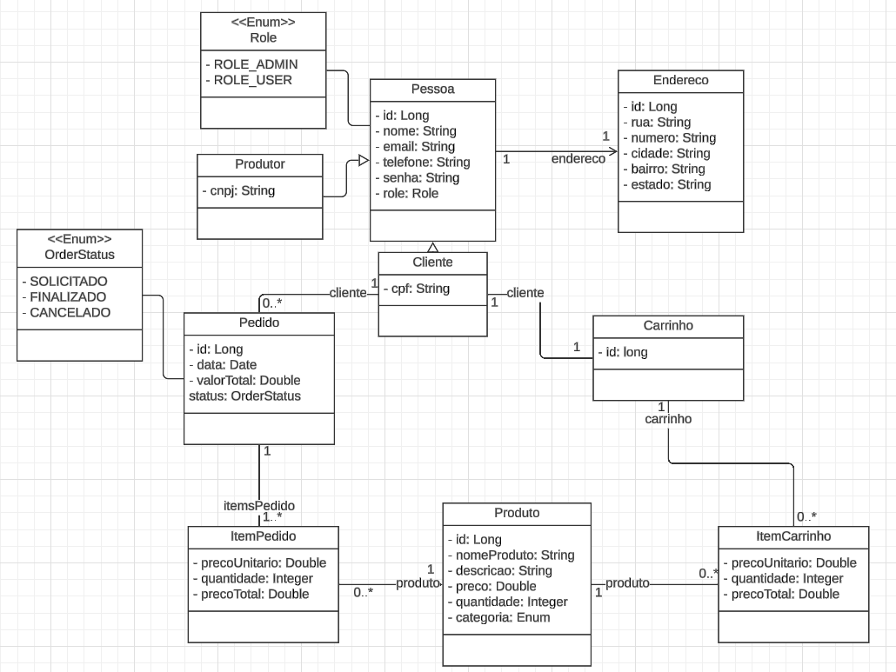

# Ecommerce

> O projeto é um e-commerce desenvolvido com Angular, focado em oferecer uma experiência de compra intuitiva e dinâmica. Ele permite navegação fácil, exibição de produtos, gerenciamento de carrinho.

### Ajustes e melhorias

O projeto ainda está em desenvolvimento e ainda faltam algumas paginas a serem feitas:

- [ ] Login
- [ ] Cadastro
- [x] Home
- [x] Loja
- [ ] Carrinho
- [x] Produto Individual
- [ ] Cadastro de produtos
- [ ] Relatorios
- [ ] Pedidos
- [ ] Estoque
- [ ] Tela de Erro (Para produtos não encontrados ou outra coisa)
- [ ] Tela com as informações do usuario (cliente e produtor)

## 💻 Pré-requisitos

Antes de começar, verifique se você atendeu aos seguintes requisitos:

- Você instalou a versão mais recente do Angular `npm install -g @angular/cli`
- Você instalou a versão mais recente do Tailwind CSS `npm install -D tailwindcss`
- Iniciar o Tailwind dentro do projeto Angular `npx tailwindcss init`
- Você tem uma máquina `<Windows / Linux / Mac>`.
- É preciso tambem ter o Node em sua maquina `winget install Schniz.fnm -> fnm install 22`.

## ☕ Executando o projeto
- Para executar o projeto `ng serve`.
- Para executar o projeto em um navegador especifico `$env:BROWSER="chrome"; ng serve --open`.

> [!WARNING]  
> No lugar do chrome você escolhe o navegador que desejar, caso ele nao seja seu navegador principal.

## 📝 Licença

Esse projeto está sob licença. Veja o arquivo [LICENÇA](LICENSE.md) para mais detalhes.

## 🤝 Colaboradores

Agradecemos às seguintes pessoas que contribuíram para este projeto:

<table>
  <tr>
    <td align="center">
      <a href="https://github.com/JhonnyBCastro" title="defina o título do link">
         
        
          <b>Jhonata Castro</b>
        
      </a>
    </td>
  </tr>
</table>
# ecommerce-laticionios
Este projeto é uma plataforma de e-commerce para a venda de laticínios por encomenda, desenvolvida para um vendedor autônomo.

## Diagrama de Classes

# Funcionalidades Implementadas

## Usuário Comum / Cliente
- **Cadastro**: Usuário comum pode se registrar no site.
- **Login**: Cliente que esteja previamente cadastrado no sitema pode realizar o login.
- **Gerenciamento de Dados** - acesso apenas para *Clientes* logados:
  - Visualizar os detalhes de seus dados.
  - Editar seus dados pessoais.
- **Catálogo de Produtos** - acesso para qualquer tipo de *USUÁRIO*:
  - Visualizar o catálogo de produtos disponíveis.
  - Pesquisar produtos por nome.
- **Carrinho de Compras** - acesso apenas para *Clientes* logados:
  - Adicionar produtos ao carrinho.
  - Visualizar os itens do carrinho.
  - Remover produtos do carrinho.
  - Finalizar o pedido com os itens do carrinho.

## Administrador / Produtor
- **Gerenciamento de Produtos**:
  - Registrar novos produtos.
  - Listar todos os produtos.
  - Atualizar informações de produtos pelo ID.
  - Remover produtos pelo ID.
  - Buscar produtos específicos pelo ID.
- **Gerenciamento de Pedidos**:
  - Listar todos os pedidos.
  - Buscar pedidos específicos pelo ID.
  - Listar pedidos filtrados por status.
  - Atualizar o status de um pedido.

---

# Funcionalidades Planejadas

## Usuário Comum / Cliente
- Acompanhar o andamento de seus pedidos (status em tempo real).

## Administrador / Produtor
- **Relatórios de Vendas**:
  - Listar vendas realizadas em um determinado período, incluindo informações como valor total e produtos mais vendidos.
- **Controle de Estoque**:
  - Verificação automatizada que notifica o administrador sobre a quantidade disponível de produtos no estoque.

---

Este documento será atualizado conforme novas funcionalidades forem implementadas.

---
# Rotas

## Qualquer usuário que não precise estar logado
- **/products**  - um método GET que lista todos os produtos
- **/products/{id}**  - método GET que irá listar o detalhe de um produto
- **/products/search?name=** - método GET que lista produtos de acordo com o nome pesquisado
- **/auth/register** - método POST para o usuário se registrar
- **/auth/login** - método POST para o usuário logar

## Usuário logado(cliente) que fez o login no sistema e possui o token:
- **/profile**  - método GET que lista as informações do cliente 
- **/profile**  - método POST que atualiza as informações do cliente
- **/cart/add**  - método POST onde o cliente adiciona o item ao seu carrinho
- **/cart**  - método GET que exibe o carrinho do cliente com os itens que estão nele
- **/cart/{productId}**  - método DELETE onde o cliente pode remover o item que está no carrinho 
- **/cart/buy**  - método POST que é responsável por fazer a compra dos itens que estão no carrinho

## Usuário logado (ADM) que fez o login no sistema e possui o token:
- **/products**  - método POST que insere novos produtos
- **/products/{productId}**  - método PUT que atualiza as informações de um produto
- **/products/{productId}**  - método DELETE que deleta algum produto
- **/orders** - método GET que lista todos os pedidos
- **/orders/{orderId}** - método GET que lista os detalhes de um pedido
- **/orders/search?status=** - método GET que lista todos os pedidos de acordo com o status
- **/orders/{orderId}?status=** - método PUT para atualizar o status de um pedido

